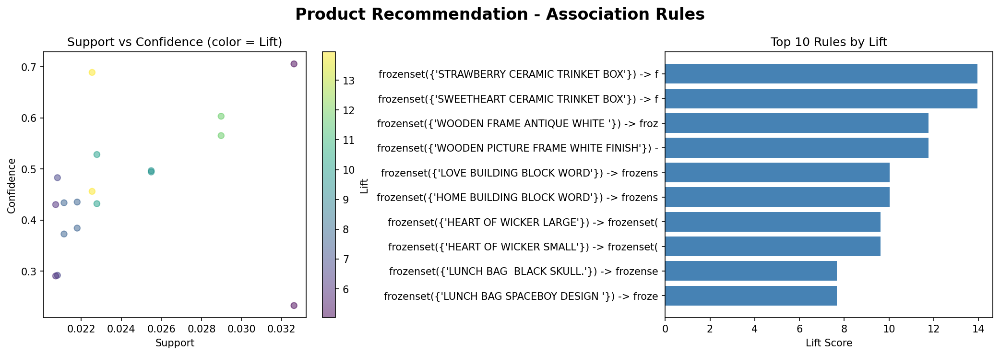

# Product Recommendation System

## Project Overview
This project builds a product recommendation system using the Apriori algorithm and association rules
on an e-commerce dataset. The goal is to identify which products are frequently bought together
and generate actionable recommendations — similar to "Customers who bought this also bought..."

## Notebook
[Open in Google Colab](https://colab.research.google.com/drive/1oWkHtEshcBef5XNVFevp_ycCVCDFQrVh?usp=sharing)

## Dataset
- **Source:** [Online Retail II Dataset - UCI / Kaggle](https://www.kaggle.com/datasets/lakshmi25npathi/online-retail-dataset)
- **Size:** 1,067,371 transactions
- **Period:** December 2009 - December 2011

## Methodology
1. **Data Cleaning** - Removed cancelled orders, null values, and negative quantities
2. **Basket Matrix** - Created a binary invoice-product matrix for UK transactions
3. **Apriori Algorithm** - Identified frequent itemsets with min support of 2%
4. **Association Rules** - Generated rules using lift metric (min threshold 1.5)
5. **Recommendation Function** - Returns top product recommendations for any given product

## Key Metrics
- **Support** - How frequently items appear together
- **Confidence** - Probability of buying item B given item A
- **Lift** - Strength of the association above random chance

## Visualizations

## Technologies Used
- **Python** - pandas, numpy, matplotlib, seaborn, mlxtend
- **Google Colab** - Development environment
- **GitHub** - Version control

## Author
hilalinie | Industrial Engineering Student | Data Science Enthusiast
